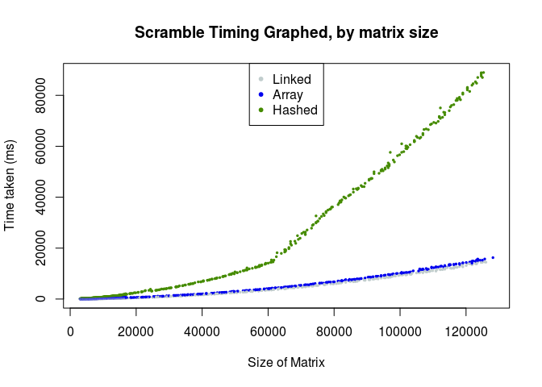
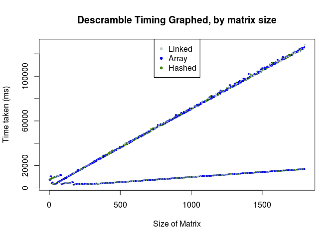
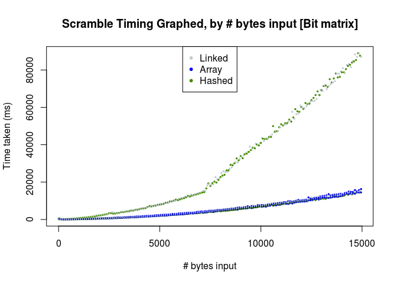
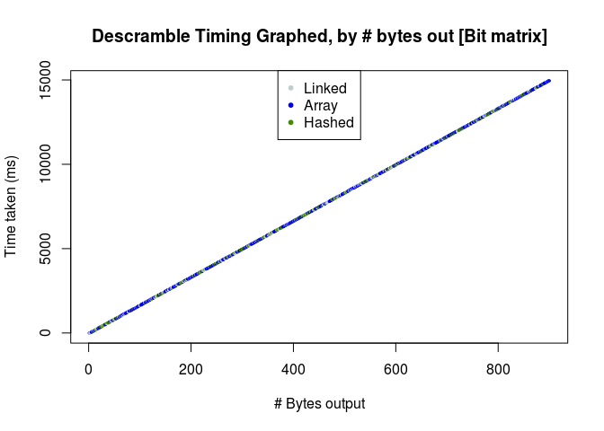

OWAT-J Matrix Implementation Analysis
================
Greg Stewart
May 15, 2018

<!--
This script takes the runtime data from OWAT and performs analyis on the results.

In particular, it is comparing the different implementations of matrices used in the library.

It also outputs the best places for the runner to decide to run one implementation or another.

Author: Greg Stewart

Requires R markdown (install.packages("rmarkdown"))
-->
Quick Summary:
--------------

